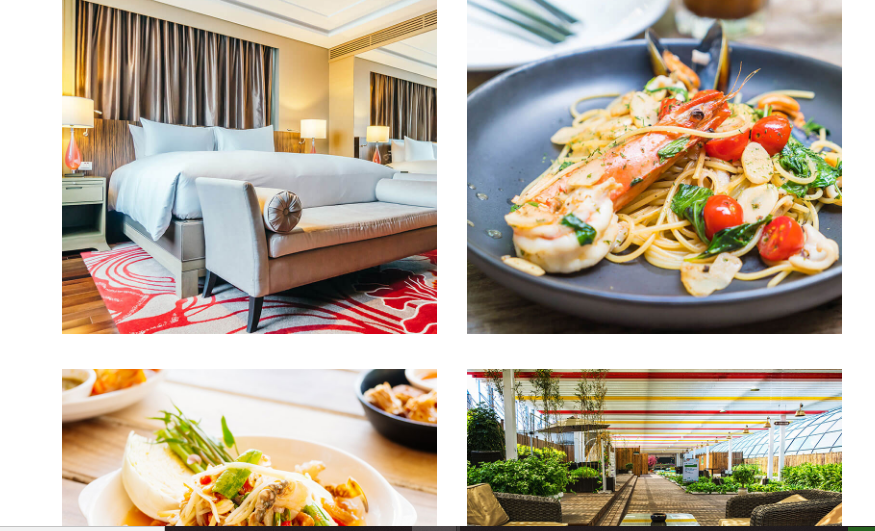
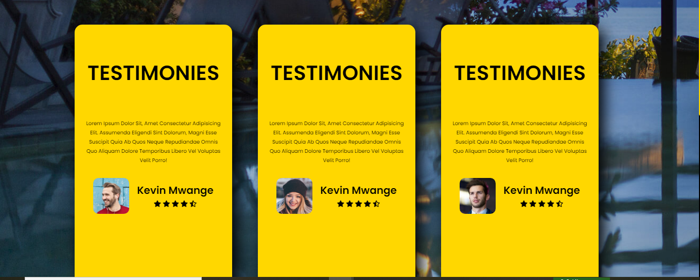
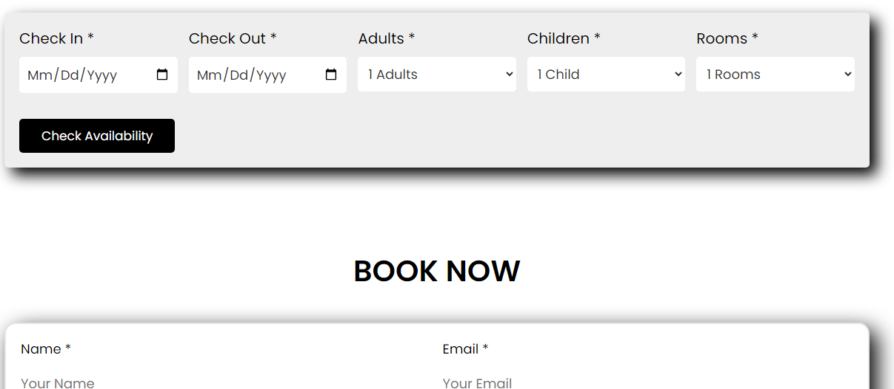

## Golden Gates Hotel
Our hotel website is designed to provide guests with a seamless and delightful experience from the moment they arrive. Whether you're a traveler seeking a cozy retreat or a business professional in need of a comfortable stay, our website has you covered.

link to the deployed page
```
https://mwangelee.github.io/golden-gates-hotel/
```
## Tools
The website is developed using:
1. HTML5
2. CSS3
3. JAVASCRIPT
## Prequisites
1. A `Terminal` for those on **Linux** or **MacOS** and  `Gitbash` for those on **Windows**.
2. Visual Studio code or any other type of editor where the code will be displayed.
3. ` Node.js` and  `npm` (Node Package Manager): This website is built using JavaScript, and you'll need Node.js and npm to manage project dependencies and run scripts. You can download them from the **official Node.js website.**
4. `Web Browser:` Make sure you have a modern web browser installed, such as Google Chrome, Mozilla Firefox, or Safari, to access and view the website.
## Set up
1. Clone the repository to your local machine.

```
git clone https://github.com/MwangeLee/golden-gates-hotel.git
```
2. Navigate to the project directory.
```
cd golden-gates-hotel
```
3. Install the project dependencies.
```
npm install
```
4. Start the development server.
```
npm start
```
## Screenshots
A selection of some of the websites interfaces :







## Known Issues
its all good

## Author
The website is developed by :
1. [John mutua](https://github.com/Issa783)
2. [Morris muia](https://github.com/morrismuia)
3. [levin mwange](https://github.com/MwangeLee)
4. Herve Irakiza

## Contributions
Contributions are welcome feel free to open a pull request.
## License
The project is licensed under the [MIT LICENSE](https://choosealicense.com/licenses/mit/)

